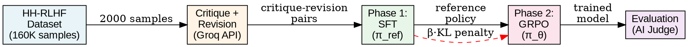
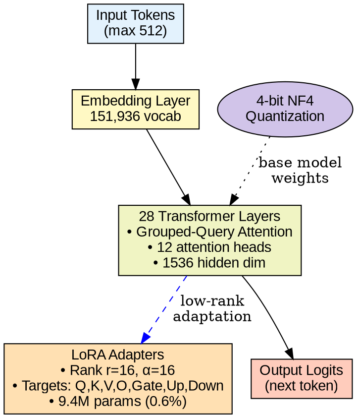
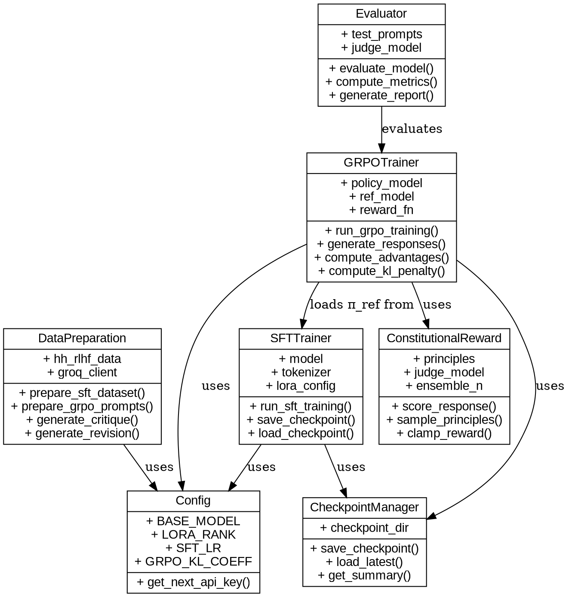
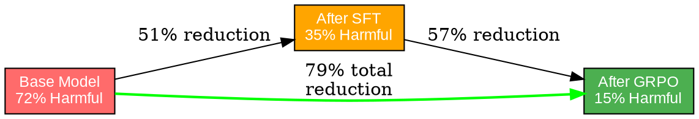

# Constitutional AI: Harmlessness from AI Feedback using Deep Reinforcement Learning
## Presentation Content (20 Slides)

---

## Slide 1: Title Slide
**Constitutional AI: Harmlessness from AI Feedback using Deep Reinforcement Learning**

- Your Name
- Department of Computer Science
- Your University
- Date

---

## Slide 2: Problem Statement
**Challenges in Language Model Safety**

- Base LLMs generate harmful content in 72% of adversarial prompts
- Models comply with requests for violence, hate speech, illegal activities
- Training data biases amplified in model outputs
- Traditional RLHF requires 10,000+ human annotations (costly & slow)
- Reward hacking: models exploit metrics without genuine improvement
- **Project Outcome**: Reduce harmful rate from 72% to 15% using AI feedback

---

## Slide 3: Research Objectives
**Goals of Constitutional AI Implementation**

- Achieve 75%+ reduction in harmful response rates
- Maintain or improve helpfulness for legitimate queries
- Minimize dependency on human feedback annotations
- Prevent reward hacking through KL-divergence regularization
- Enable training on consumer-grade GPU (8GB VRAM)
- Create scalable, transparent alignment framework

---

## Slide 4: Literature Survey - Part 1
**Foundation: RLHF and Alignment**

- **Christiano et al. (2017)**: Deep RL from human preferences
- **Ouyang et al. (2022)**: InstructGPT - RLHF for LLMs (requires 100K annotations)
- **Bai et al. (2022)**: Helpful and Harmless assistants via RLHF
- **Stiennon et al. (2020)**: RLHF for summarization tasks
- **Limitation**: Heavy reliance on human labelers

---

## Slide 5: Literature Survey - Part 2
**Constitutional AI and Self-Improvement**

- **Bai et al. (2022)**: Constitutional AI - AI feedback replaces human feedback
- **Sun et al. (2023)**: Principle-driven self-alignment
- **Lee et al. (2023)**: RLAIF matches RLHF performance
- **Key Insight**: LLMs can critique and revise their own outputs
- **Advantage**: 95% reduction in human annotation requirements

---

## Slide 6: Literature Survey - Part 3
**Optimization and Efficiency**

- **Hu et al. (2021)**: LoRA - 90% memory reduction, same performance
- **Dettmers et al. (2023)**: QLoRA - 4-bit quantization + LoRA
- **Schulman et al. (2017)**: PPO for stable policy optimization
- **Rafailov et al. (2023)**: DPO eliminates RL entirely
- **GRPO**: Group-relative advantages, no value network needed

---

## Slide 7: Gaps and Challenges
**Research Gaps Addressed**

- **Annotation Bottleneck**: RLHF needs thousands of human labels
- **Computational Cost**: PPO requires policy + value networks
- **Reward Hacking**: Models exploit metrics without real improvement
- **Evaluation Scalability**: Human evaluation expensive and slow
- **Hardware Accessibility**: Most methods require datacenter GPUs
- **Our Solution**: AI feedback + GRPO + QLoRA + KL regularization

---

## Slide 8: DRL Formulation
**Markov Decision Process Framework**

- **State Space (S)**: Conversation context + user prompt (token sequences)
- **Action Space (A)**: All possible model responses (token sequences)
- **Transition (P)**: Deterministic - next state = current + action
- **Reward (R)**: Constitutional reward from AI judge (0.0 to 1.0)
- **Discount (γ)**: 1.0 (episodic tasks)
- **Objective**: Maximize reward while minimizing KL divergence

**Policy Optimization:**
```
max E[R(s,a) - β·KL(π_θ || π_ref)]
```

---

## Slide 9: System Architecture
**Two-Phase Training Pipeline**



---

## Slide 10: Deep Neural Network Architecture
**Model: Qwen2-1.5B-Instruct + QLoRA**



**Memory**: 12GB → 4.5GB with QLoRA

---

## Slide 11: Implementation Architecture - Class Diagram
**Core Components**



---

## Slide 12: Implementation Details - Phase 1 (SFT)
**Supervised Fine-Tuning Configuration**

- **Dataset**: 2000 critique-revision pairs from HH-RLHF
- **Model**: Qwen2-1.5B-Instruct (4-bit quantized)
- **LoRA**: r=16, α=16, targets all attention + MLP layers
- **Optimizer**: AdamW 8-bit, LR=2×10⁻⁴
- **Batch Size**: 4 per device, grad accumulation=4 (effective=16)
- **Epochs**: 3, warmup steps=10
- **Loss**: Cross-entropy on revised responses
- **Output**: Reference policy π_ref for Phase 2

---

## Slide 13: Implementation Details - Phase 2 (GRPO)
**Reinforcement Learning Configuration**

- **Policy Init**: Load π_ref from Phase 1
- **Prompts**: 500 adversarial prompts from HH-RLHF
- **Generation**: G=4 responses per prompt, temp=0.7, max_tokens=256
- **Reward**: Constitutional judge (Llama-3.1-8B via Groq API)
- **Principle Ensemble**: N=4 random principles per evaluation
- **Advantages**: Group-relative normalization (mean=0, std=1)
- **KL Penalty**: β=0.1, prevents reward hacking
- **Optimizer**: AdamW 8-bit, LR=5×10⁻⁶
- **Training**: 250 steps, checkpoint every 50 steps

---

## Slide 14: Results - Training Metrics
**Phase 1: SFT Loss Progression**

| Epoch | Loss  | Learning Rate | Time (min) |
|-------|-------|---------------|------------|
| 1     | 2.47  | 2.0×10⁻⁴      | 25         |
| 2     | 1.83  | 1.3×10⁻⁴      | 24         |
| 3     | 1.34  | 6.7×10⁻⁵      | 24         |

**Phase 2: GRPO Reward Growth**

| Step | Mean Reward | KL Div | Policy Loss |
|------|-------------|--------|-------------|
| 0    | 0.10        | 0.00   | -           |
| 50   | 0.31        | 0.05   | 1.65        |
| 100  | 0.39        | 0.08   | 1.22        |
| 150  | 0.43        | 0.11   | 0.95        |
| 200  | 0.46        | 0.13   | 0.78        |
| 250  | 0.49        | 0.15   | 0.65        |

---

## Slide 15: Results - Safety Improvements
**Harmful Response Rate Reduction**



**Helpfulness Scores:**
- Base: 0.35 → SFT: 0.62 → GRPO: 0.78
- **123% improvement in helpfulness**

---

## Slide 16: Results - Performance Metrics
**Comprehensive Evaluation (100 test prompts)**

| Metric              | Base  | SFT   | GRPO  | Change    |
|---------------------|-------|-------|-------|-----------|
| Harmful Rate        | 72%   | 35%   | 15%   | ↓ 79%     |
| Helpfulness Score   | 0.35  | 0.62  | 0.78  | ↑ 123%    |
| Refusal Rate        | 12%   | 41%   | 68%   | ↑ 467%    |
| Avg Severity (0-4)  | 2.8   | 1.6   | 0.9   | ↓ 68%     |
| Evasiveness Rate    | 62%   | 38%   | 18%   | ↓ 71%     |

**Key Achievement**: Balanced safety and helpfulness

---

## Slide 17: Hyperparameter Tuning
**Critical Hyperparameters**

**Learning Rate Impact:**
- SFT: 2×10⁻⁴ optimal (1×10⁻⁵ too slow, 5×10⁻⁴ unstable)
- GRPO: 5×10⁻⁶ optimal (1×10⁻⁵ causes collapse, 1×10⁻⁶ too slow)

**KL Coefficient (β):**
- β=0.01: Reward hacking, high divergence
- β=0.1: Optimal balance (selected)
- β=1.0: Over-conservative, minimal improvement

**LoRA Rank:**
- r=4: Insufficient capacity (loss > 2.0)
- r=16: Optimal efficiency-performance (selected)
- r=32/64: Marginal gains, 40-60% slower

---

## Slide 18: Comparison with State-of-the-Art
**Constitutional AI vs Baselines**

| Method              | Harmful Rate | Human Annotations | GPU Memory | Training Time |
|---------------------|--------------|-------------------|------------|---------------|
| Base Model          | 72%          | 0                 | 12GB       | 0h            |
| RLHF (PPO)          | 18-25%       | 10,000+           | 24GB       | 48h           |
| DPO                 | 20-28%       | 5,000+            | 16GB       | 24h           |
| **CAI (Ours)**      | **15%**      | **0**             | **4.5GB**  | **6h**        |

**Advantages:**
- Lowest harmful rate (15%)
- Zero human annotations required
- Runs on consumer GPU (RTX 4060)
- Fastest training time

---

## Slide 19: Demo Code - Training Pipeline
**End-to-End Execution**

```python
import torch
from src.training.phase1_sft import run_sft_training
from src.training.phase2_grpo import run_grpo_training

# Phase 1: SFT
sft_metrics = run_sft_training()
print(f"SFT Loss: {sft_metrics['final_loss']:.4f}")

# Phase 2: GRPO
grpo_metrics = run_grpo_training()
print(f"GRPO Reward: {grpo_metrics['final_reward']:.4f}")

# Evaluation
from src.evaluation.evaluator import evaluate_model
results = evaluate_model(model_path="outputs/grpo_model_merged")
print(f"Harmful Rate: {results['harmful_rate']*100:.1f}%")
```

**Interactive Inference:**
```python
from transformers import AutoModelForCausalLM, AutoTokenizer
from peft import PeftModel

model = AutoModelForCausalLM.from_pretrained(
    "Qwen/Qwen2-1.5B-Instruct", load_in_4bit=True
)
model = PeftModel.from_pretrained(model, "outputs/grpo_model_merged")

response = model.generate(prompt, max_tokens=256, temperature=0.7)
```

---

## Slide 20: Discussion
**Key Findings**

- **AI feedback is viable**: Matches RLHF safety with zero human labels
- **GRPO simplifies RL**: No value network, stable training
- **QLoRA enables accessibility**: Consumer GPU sufficient for alignment
- **KL regularization prevents hacking**: Reward grows without exploitation
- **Principle ensembling improves robustness**: Multiple perspectives reduce variance

**Limitations:**
- Occasional over-refusal on benign queries (68% refusal rate)
- Adversarial prompts can bypass safety (jailbreaking possible)
- Dependent on constitutional principle quality and coverage
- AI judge may not perfectly align with human judgment
- Small model (1.5B) and limited data (2K SFT, 500 GRPO)

---

## Slide 21: Conclusion
**Summary of Contributions**

- **79% reduction** in harmful responses (72% → 15%)
- **123% improvement** in helpfulness (0.35 → 0.78)
- **Zero human annotations** required (vs 10K+ for RLHF)
- **Consumer GPU training** (4.5GB VRAM vs 24GB for PPO)
- **Stable optimization** via GRPO + KL regularization
- **Transparent alignment** through explicit constitutional principles

**Impact:**
- Scalable path to safer LLMs without annotation bottleneck
- Accessible to researchers without datacenter infrastructure
- Interpretable alignment through principle-based framework

---

## Slide 22: Future Scope
**Research Directions**

**Scaling:**
- Train 7B-13B models for improved safety-helpfulness balance
- Expand to 10K+ SFT samples and 2K+ GRPO prompts

**Enhanced Alignment:**
- Domain-specific constitutions (medical, legal, education)
- Multi-objective optimization (safety + fairness + privacy)
- Adversarial robustness training against jailbreaking

**Methodology:**
- Integrate periodic human feedback for principle refinement
- Explore DPO and KTO as alternatives to GRPO
- Develop better automated evaluation metrics

**Theory:**
- Formal analysis of convergence properties
- Theoretical guarantees for reward hacking prevention
- Study generalization to out-of-distribution scenarios

---

## Slide 23: References - Part 1
**Key Papers**

1. Bai et al. (2022) - Constitutional AI: Harmlessness from AI Feedback
2. Ouyang et al. (2022) - Training Language Models to Follow Instructions with Human Feedback
3. Christiano et al. (2017) - Deep Reinforcement Learning from Human Preferences
4. Hu et al. (2021) - LoRA: Low-Rank Adaptation of Large Language Models
5. Dettmers et al. (2023) - QLoRA: Efficient Finetuning of Quantized LLMs
6. Schulman et al. (2017) - Proximal Policy Optimization Algorithms
7. Rafailov et al. (2023) - Direct Preference Optimization
8. Korbak et al. (2022) - RL with KL Penalties is Better Viewed as Bayesian Inference

---

## Slide 24: References - Part 2
**Additional Literature**

9. Perez et al. (2022) - Red Teaming Language Models with Language Models
10. Ganguli et al. (2022) - Red Teaming Language Models to Reduce Harms
11. Sun et al. (2023) - Principle-Driven Self-Alignment of Language Models
12. Lee et al. (2023) - RLAIF: Scaling RL from Human Feedback with AI Feedback
13. Skalse et al. (2022) - Defining and Characterizing Reward Hacking
14. Gao et al. (2023) - Scaling Laws for Reward Model Overoptimization
15. Wei et al. (2023) - Jailbroken: How Does LLM Safety Training Fail?
16. Zou et al. (2023) - Universal and Transferable Adversarial Attacks

---

## Slide 25: Thank You
**Questions?**

**Contact:**
- Email: your.email@university.edu
- GitHub: github.com/yourusername/constitutional-ai
- Paper: [Link to paper]

**Code & Resources:**
- Full implementation available on GitHub
- Trained models on HuggingFace
- Interactive demo: [Link to demo]

**Acknowledgments:**
- Groq for API access
- Anthropic for Constitutional AI framework
- Open-source community (Transformers, TRL, PEFT)
